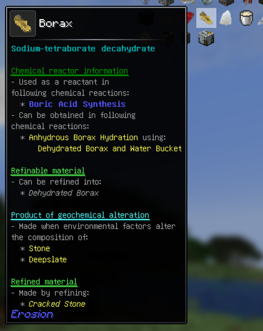
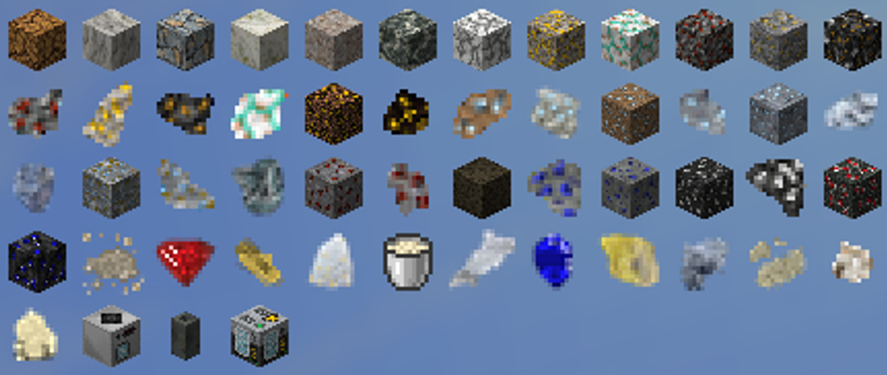
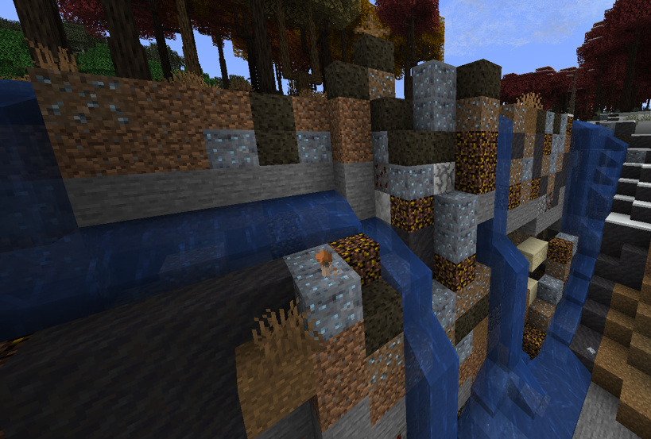
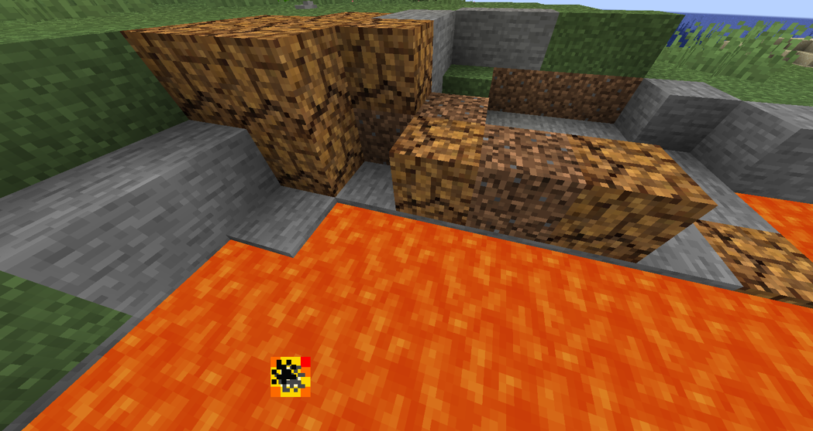
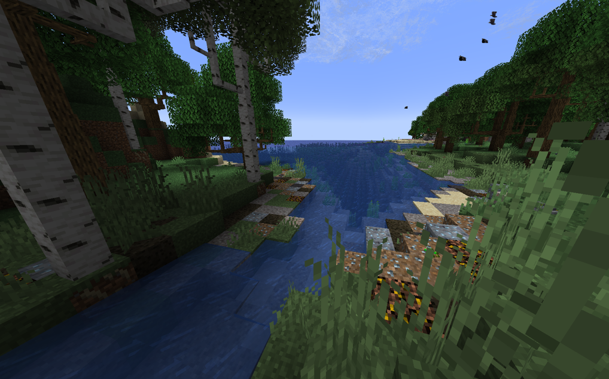
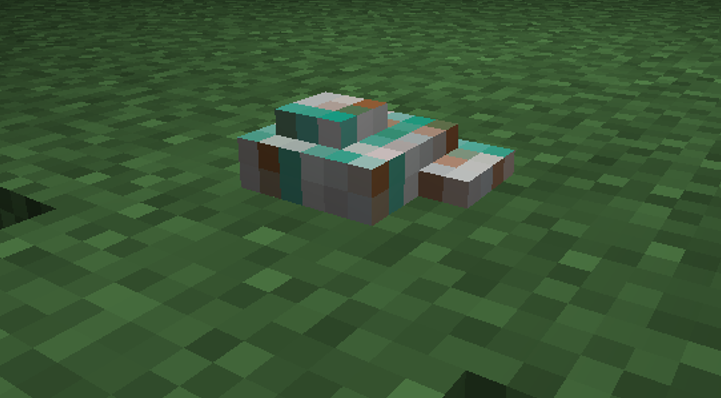

    

Although this mod is called `Erosion`, it is focused on all kinds of geochemical processes that can alter blocks such as different types of stone, dirt and more.

Each item this mod adds or modifies gets its nicely described tooltip like this, so you cannot get lost!

    

Creative tab:

    

As you can see blocks can be altered by lava or water present.

    

    

    

There are nice minerals that spawn in real-time as your rivers erode the soil.
This mod adds malachite, limonite, magnetite, hematite, bismuthinite, cassiterite, and more!

    

## Compatible mods
I highly recommend following mods for a bigger level of immersiveness:
- Create (Zinc Chunks can be crafted into Raw Zinc)
- Oreganized (same but for Silver)
- This Rocks! (Forge version) (just adds a bigger variety of spawn)
- Overgeared: A Blacksmith Mod
- Streams Reflowing

## Can I run this?
Although geochemical alteration of blocks and spawning of mineral rocks is a live process that is happening as you explore your world, the mod is very optimized and works seamlessly on Intel Pentium server while maintaining 20 TPS!
- The mod consumes very few resources thanks to the FastUtil library. All important into can be obtained on the F3 menu.
- This mod uses its own retrogeneration and feature placement system which is different from the default Minecraft's one. It uses several queues combined with carefully forged selection system to process processes and features, so your world will not lag!
- However if you want your world to lag, you can turn on aggressive queue processing in the `erosion_config` folder and then use `/erosion reload_config`.

## More info
- This mod was written for NeoForge 1.21.1 purely as a hobby project. No AI-generated content.
- I have no plans to port this to anything else whatsoever.
- You are free to use this in any modpack.
- This mod is in early development stage, so its code is being heavily refactored and reworked on a daily basis - so no pull requests please!
- May receive new updates very often.

Wanna give it a try?
Download now!

Join Discord server to give new ideas! 
Link: https://discord.gg/gFvUagQbBd